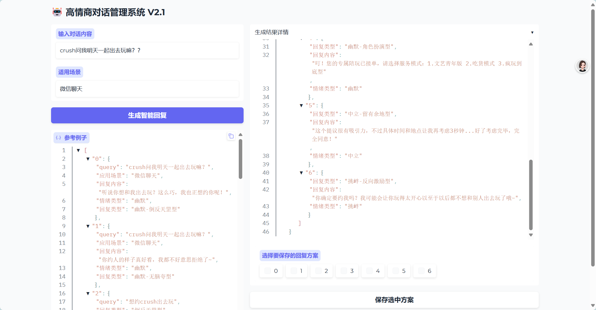
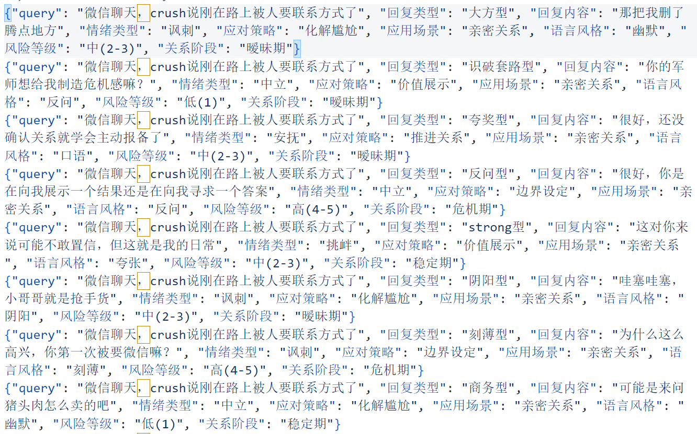

# 高情商机器人

聊天是否会觉得自己情商低，每次冷场，为什么生活无法像二次元游戏一样给你弹出三个对话选项，哎，那我就做一个。

# 前端展示



## 数据飞轮
由于本身爬取的高情商对话比较少，在每次调用完模型后，可以选择将模型的回答存起来，下次调用时，直接从数据库中读取。这样能增加可检索到的数据数量。

## 检索系统
只根据query和数据里面对应的query检索，不包含回复，然后再尽量选更多种类的情绪，首选积极和幽默，其他的少一些

# 尝试

效果会跟模型关系比较大，dsr1的效果会很好，32b和豆包的效果会很比较普通。

## dsr1
```json
{
"分析": {
"潜在意图": "回应crush的表白，既表达欣喜又保持适度矜持，通过轻松互动拉近关系",
"情感类型推荐": ["幽默+积极", "钓系+调侃"],
},
"推荐回复": [
{
"回复类型": "倒叙陷阱型",
"回复内容": "这么快就表白了？我连追你的计划表都还没打印呢",
"情感类型": "幽默+积极",
},
{
"回复类型": "星象占卜型",
"回复内容": "刚查了今日黄历，宜收男友/女友一枚，你猜准不准？",
"情感类型": "钓系+调侃",
},
{
"回复类型": "生活场景型",
"回复内容": "现在心跳有点快，可能需要人工呼吸服务——或者你再说十遍刚才的话？",
"情感类型": "积极+幽默",
}
]
}
```

## dsr132-qwen
```json
{
    "分析": {
        "潜在意图": "收到crush的表白，希望以高情商的方式回应，表达开心和接受，同时保持轻松和幽默的氛围。",
        "情感类型推荐": ["幽默", "积极", "中立"]
    },
    "推荐回复": [
        {
            "回复类型": "幽默",
            "回复内容": "哈哈，原来你一直在偷偷观察我啊！看来我的魅力终于被发现了，终于可以光明正大地在一起了！",
            "情感类型": "幽默"
        },
        {
            "回复类型": "积极",
            "回复内容": "真的吗？我也有点喜欢你很久了呢！现在终于可以一起走下去了，期待和你分享更多美好的时光！",
            "情感类型": "积极"
        },
        {
            "回复类型": "中立",
            "回复内容": "谢谢你这么勇敢地表达出来，我也一直觉得你很特别。我们可以慢慢来，享受这段感情。",
            "情感类型": "中立"
        }
    ]
}
```

## 豆包
```json
{
    "分析": {
        "潜在意图": "crush向用户表达爱意，希望与用户建立恋爱关系",
        "情感类型推荐": ["幽默", "积极"] 
    },
    "推荐回复": [
        {
            "回复类型": "幽默，调侃型",
            "回复内容": "哇，你这突然的表白就像给我发了个“爱情盲盒”，我赚大啦！",
            "情感类型": "幽默"
        },
        {
            "回复类型": "积极，热情型",
            "回复内容": "我也一直在等你说出这句话呢，我愿意和你开启甜甜的恋爱！",
            "情感类型": "积极"
        }
    ]
}
```

## 部分数据展示

